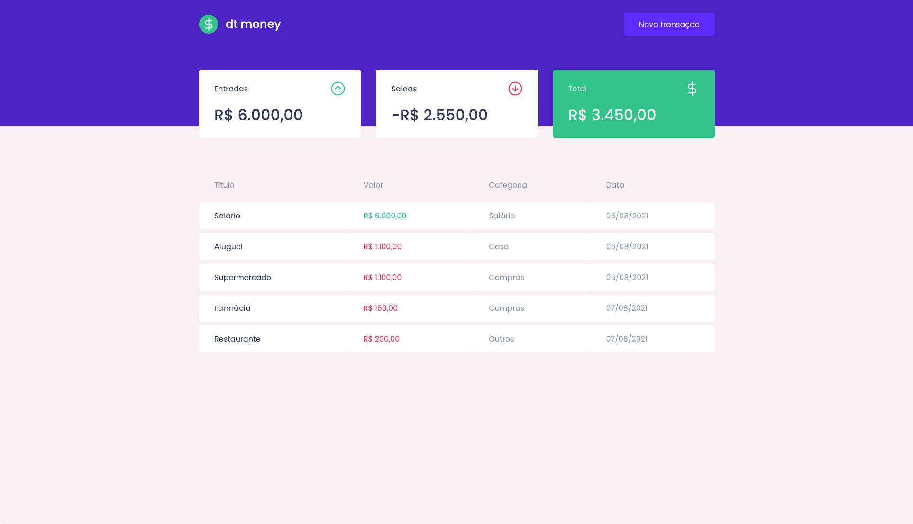
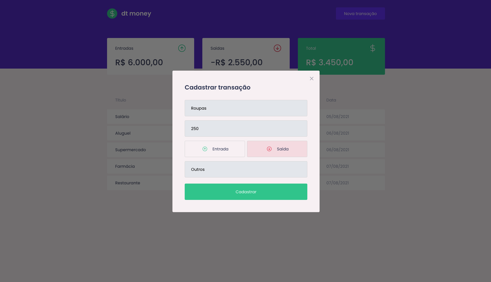
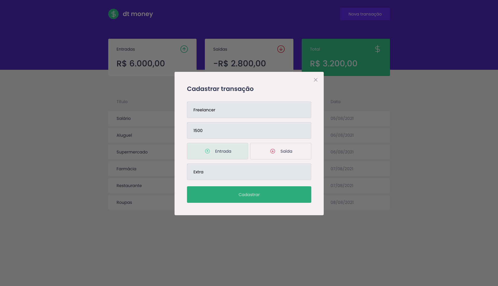
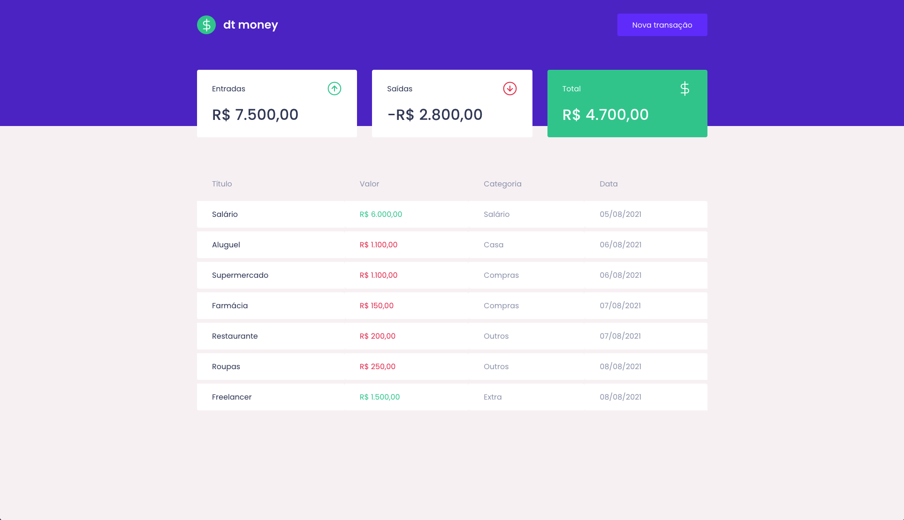

<p align="center">
   
</p>

<p align="center">
   <a href="https://www.linkedin.com/in/carolinegoulart/">
      
   </a>
  
  
  <a href="mailto:goulartscaroline@gmail.com">
   
  </a>
</p>

<p align="center">
  Manage your money! Project developed during the Ignite Bootcamp provided by <a href="https://github.com/Rocketseat">@Rocketseat</a> :rocket:
</p>

<div align="center">
  <p> Made with :heart: by
    <a href="https://github.com/carolinegoulart">Caroline Goulart</a>
  </p>
</div>

# :pushpin: Contents

- [Screenshots](#camera-screenshot)
- [Technologies](#rocket-technologies)
- [How to Run](#computer-how-to-run)
- [Issues](#bug-issues)
- [Contributing](#sparkles-issues)
- [License](#page_facing_up-license)

# :camera: Screenshots

<div align="center">
   
   
   
   
</div>

# :rocket: Technologies

This project was made using the follow technologies:

- [Typescript](https://www.typescriptlang.org/)
- [React](https://reactjs.org/)
- [Styled Components](https://styled-components.com/)
- [MirageJS](https://miragejs.com/)

# :computer: How to run

```bash
# Clone Repository
$ git clone https://github.com/carolinegoulart/ignite-dtmoney.git
```

```bash
# Install Dependencies
$ yarn

# Run Aplication
$ yarn start
```

Go to http://localhost:3000 to see the result.

# :bug: Issues

Create a <a href="https://github.com/carolinegoulart/ignite-dtmoney/issues">new issue report</a>, it will be an honor to be able to help you solve and further improve our application.

# :sparkles: Contributing

- Fork this repository;
- Create a branch with your feature: `git checkout -b my-feature`;
- Commit your changes: `git commit -m 'feat: My new feature'`;
- Push to your branch: `git push origin my-feature`.

# :page_facing_up: License

This project is under the [MIT license](./LICENSE).
Made with :heart: by [Caroline Goulart](https://www.linkedin.com/in/carolinegoulart/).

Thank you! :star:
